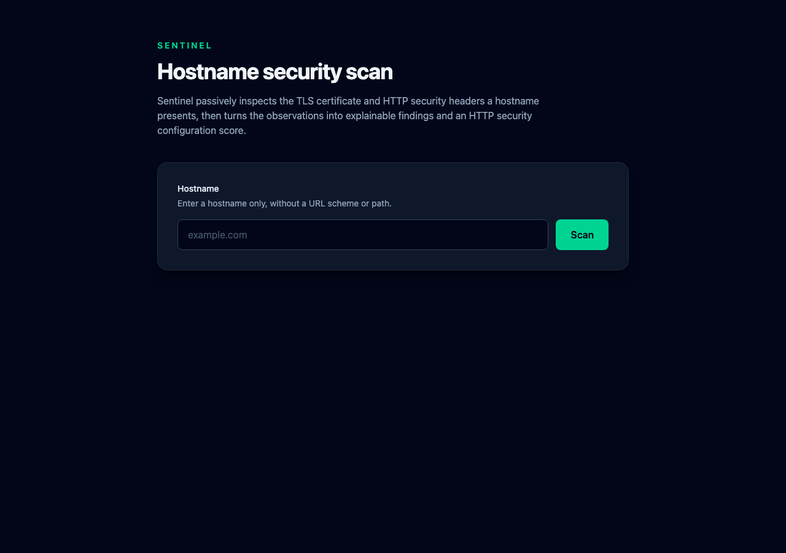
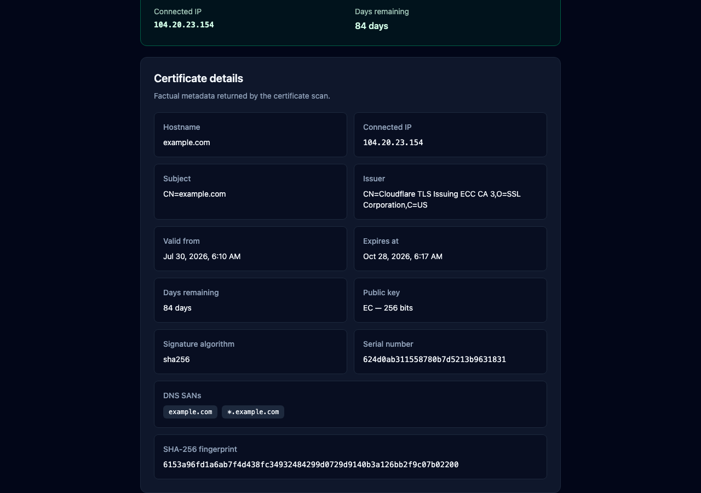
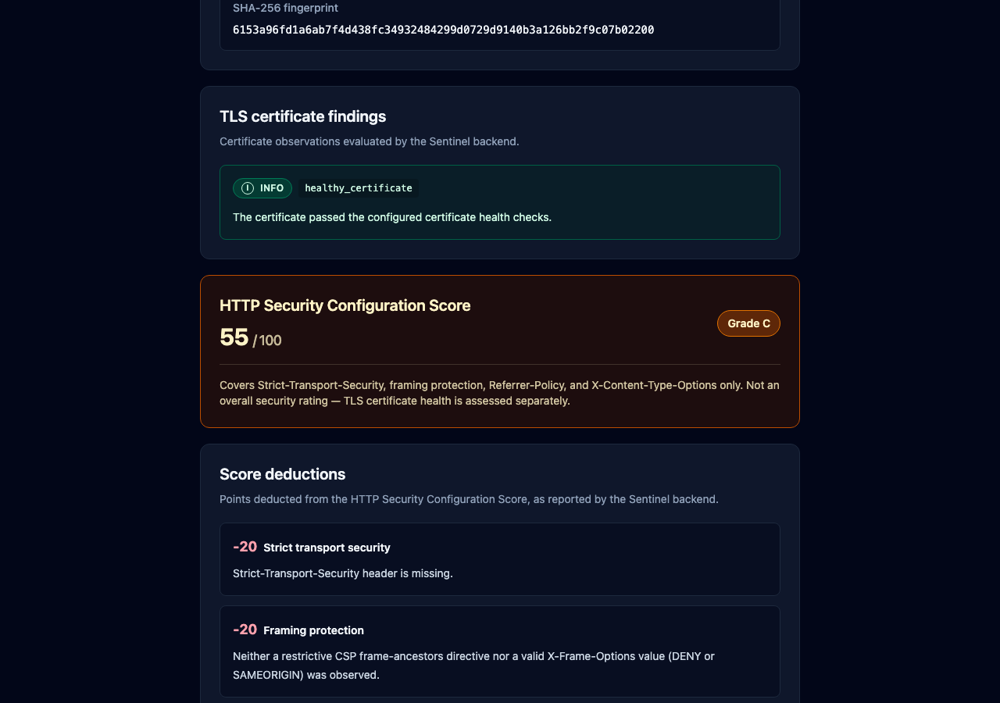
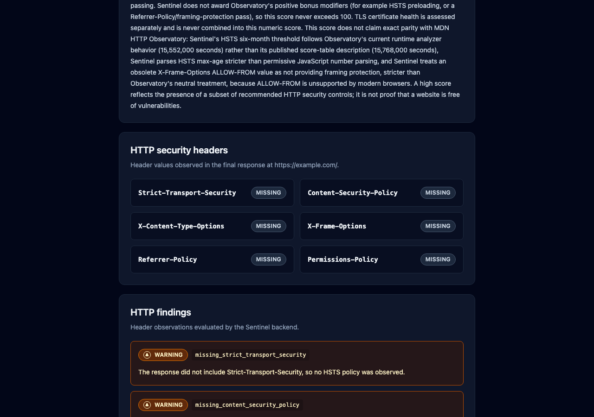
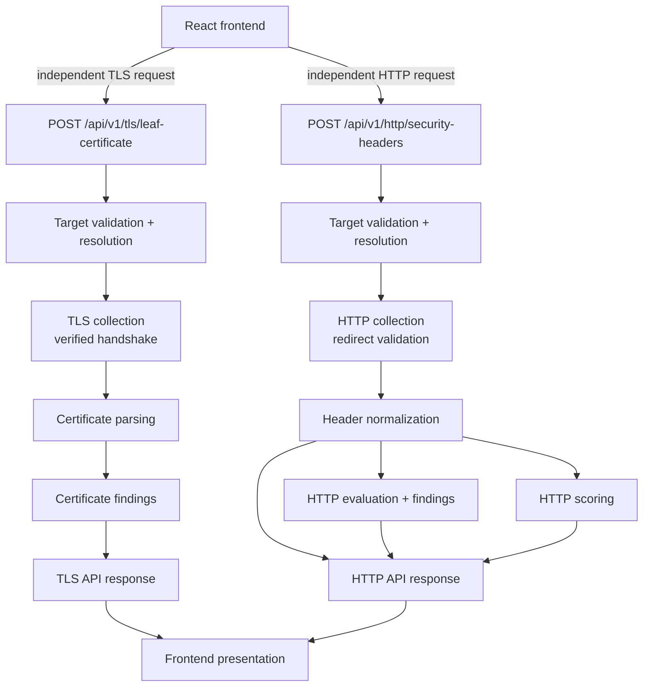

# Sentinel

Sentinel is a passive website security checker that safely inspects TLS
certificates and HTTP security headers, converts the observations into
explainable findings, and produces an HTTP security configuration score.

## Why Sentinel

Website security configuration is hard to read at a glance. A certificate
chain or a raw `Strict-Transport-Security` header value doesn't mean much
without context, and most people checking a site don't want to become a TLS
or HTTP-header expert just to answer "is this configured reasonably?"

Sentinel validates and resolves each hostname, connects to an approved
numeric IP address, and performs a verified TLS handshake while using the
validated hostname for SNI and certificate hostname verification. It observes
what is publicly presented (certificate metadata, HTTP security headers) and
turns that into structured, explainable findings — plus a score for the HTTP
header configuration, with every deduction traceable to a specific control
and reason.

## Current Features

**TLS Certificate Analysis**
- SSRF-aware target/hostname validation before any connection is made
- A verified TLS handshake (hostname verification, chain validation)
- X.509 leaf certificate parsing (subject, issuer, validity window, SANs,
  signature algorithm, public key type/size)
- Expiry and days-remaining calculation
- Certificate findings (e.g. expiry issues)

**HTTP Security Headers**
- Strict-Transport-Security (HSTS) evaluation
- Content-Security-Policy (CSP) findings
- X-Frame-Options / CSP `frame-ancestors` combined framing-protection
  evaluation
- X-Content-Type-Options evaluation
- Referrer-Policy evaluation
- Permissions-Policy findings

**HTTP Security Configuration Score**
- A 0–100 score with a letter grade, computed from a documented subset of
  HTTP header controls
- An explainable deduction breakdown: every point lost is tied to a specific
  control and a human-readable reason
- Scored controls: HSTS, framing protection, Referrer-Policy,
  X-Content-Type-Options
- Findings-only, intentionally excluded from the numeric score:
  Content-Security-Policy, Permissions-Policy

## Screenshots

Example output from a prior scan of `example.com`. Live results for any
hostname (including `example.com` itself) reflect whatever that site
presents at scan time, so a fresh scan will not necessarily match these
images exactly.

| Scan form | Example: TLS certificate result |
|---|---|
|  |  |

| Example: HTTP score and deductions | Example: HTTP headers and findings |
|---|---|
|  |  |

## Architecture



TLS and HTTP are two fully independent request/response paths — each
performs its own target validation and DNS resolution, and a TLS failure
does not block HTTP results (or vice versa). HTTP findings and HTTP scoring
are both derived from the same normalized header data, not from each other
— scoring never reads the findings list. The paths reuse common code rather
than sharing a runtime validation result: both call the same target-validation
and address-safety functions (`backend/tls_target.py`) and use the same
connector and default TLS context factory
(`backend/tls_collector.py`, reused by `backend/http_collector.py`).

## Security Design

- **SSRF-aware target validation**: hostnames are validated before any
  network call; raw IP literals are rejected outright (`backend/tls_target.py`).
- **Private/internal address blocking**: every resolved address is checked
  against private, loopback, link-local, multicast, unspecified, and
  reserved ranges before a connection is attempted (`is_globally_routable`).
- **Numeric-IP connections**: Sentinel connects to the specific IP address
  returned by DNS resolution (not by re-resolving the hostname at connect
  time), reducing exposure to DNS-rebinding races.
- **Redirect destination validation**: HTTP redirects are only followed to
  `https://` destinations, the new hostname is re-validated and re-resolved
  through the same SSRF checks, and redirect loops are detected.
- **Preserved hostname/SNI**: the validated hostname for each connection is
  passed as `server_hostname` for TLS/SNI even though the connection itself
  uses the resolved numeric address.
- **TLS hostname verification**: the default `ssl` context is used, so
  certificate chain and hostname verification both apply.
- **Bounded timeouts**: every collection has an overall deadline enforced
  with `asyncio.timeout_at`.
- **Bounded redirect attempts**: HTTP collection follows at most 3 redirects
  by default before failing closed.
- **Bounded header size**: HTTP response headers are capped at 64 KB; an
  oversized or malformed response is rejected rather than parsed.
- **Typed error handling**: expected collection failures (DNS failures,
  blocked addresses, TLS verification failures, timeouts, malformed
  responses, etc.) are represented as typed, stable failure codes and
  stages (e.g. `blocked_address`, `tls_verification_failed`,
  `overall_timeout`) and mapped to an appropriate HTTP status. Unexpected
  runtime errors outside these known failure paths can still surface as a
  generic server error rather than a typed one.

## Scoring Methodology

The HTTP Security Configuration Score starts from a baseline of 100 and
applies documented, explainable point deductions — it never invents a bonus,
so it never exceeds 100. Grade bands are fixed and documented:

| Score range | Grade |
|---|---|
| 100 | A+ |
| 90–99 | A |
| 85–89 | A- |
| 80–84 | B+ |
| 70–79 | B |
| 65–69 | B- |
| 60–64 | C+ |
| 50–59 | C |
| 45–49 | C- |
| 40–44 | D+ |
| 30–39 | D |
| 25–29 | D- |
| 0–24 | F |

This score is Sentinel-specific. It is inspired by a subset of MDN HTTP
Observatory's point-deduction approach, but it is **not** an official
Observatory score and **not** a measure of overall website security.

Controls that currently affect the score:
- Strict-Transport-Security (HSTS)
- Framing protection (X-Frame-Options and/or CSP `frame-ancestors`)
- Referrer-Policy
- X-Content-Type-Options

Controls that are findings-only and never affect the score:
- Content-Security-Policy — Sentinel does not yet reproduce enough CSP
  semantics (nonce/hash interaction with `unsafe-inline`, `strict-dynamic`,
  per-directive `data:` handling) to score it reliably, so its contribution
  is always 0 rather than a guess.
- Permissions-Policy — there is no equivalent Observatory test to base a
  defensible point value on.

TLS certificate health is assessed separately and is never combined into
this numeric score. The full methodology text, including every documented
divergence from Observatory, is returned by the API and rendered verbatim
in the frontend (`backend/http_scoring.py`).

## Tech Stack

**Backend**
- Python
- FastAPI
- `cryptography`
- `asyncio` / `socket` / `ssl`
- pytest

**Frontend**
- React
- Vite
- Tailwind CSS

## Running Locally

**Backend** (from the repository root):

```bash
python3 -m venv backend/venv
source backend/venv/bin/activate
pip install -r backend/requirements.txt
pip install -r backend/requirements-dev.txt   # needed to run tests
python -m uvicorn backend.main:app --reload --port 8000
```

The API is now available at `http://127.0.0.1:8000`.

**Frontend** (in a second terminal):

```bash
cd frontend
npm install
npm run dev
```

The frontend dev server runs at `http://localhost:5173` and proxies `/api`
requests to `http://127.0.0.1:8000` (see `frontend/vite.config.js`), so the
backend must be running on port 8000 for scans to work.

## Example Workflow

1. Enter a hostname such as `example.com` and click Scan.
2. Sentinel runs TLS and HTTP analysis concurrently.
3. Certificate details and TLS findings appear.
4. The HTTP Security Configuration Score and its deduction breakdown appear.
5. HTTP security headers and HTTP findings appear.

TLS and HTTP results are independent: if one fails (e.g. the HTTP request is
blocked or times out) the other can still succeed and render normally.

## Testing

**Backend** (from the repository root, with the venv above activated):

```bash
python -m pytest backend/tests/
```

As of this writing this is a snapshot, not a guarantee: **257 passed**. Run
the command above for the current result.

**Frontend** (from the repository root):

```bash
cd frontend
npm run lint
npm run build
```

There is currently no automated frontend test suite — frontend changes are
verified with lint, a production build, and manual browser testing.

## Limitations

- Passive configuration analysis only — Sentinel does not exploit or modify
  the target.
- Not a vulnerability scanner and not proof that a site is secure.
- No authenticated testing, no exploitation.
- CSP evaluation is simplified and is not numerically scored.
- TLS configuration/cipher-suite analysis (protocol versions, cipher
  suites, key exchange) is not implemented — only leaf-certificate
  inspection is.
- The HTTP score covers four header controls only; cookies, CORS,
  Cross-Origin-Resource-Policy, Subresource-Integrity, and redirect
  behavior are not evaluated at all.

## Future Work

- Deeper TLS configuration analysis (protocol/cipher-suite evaluation)
- Stronger CSP analysis, potentially enabling numeric CSP scoring
- Automated frontend tests
